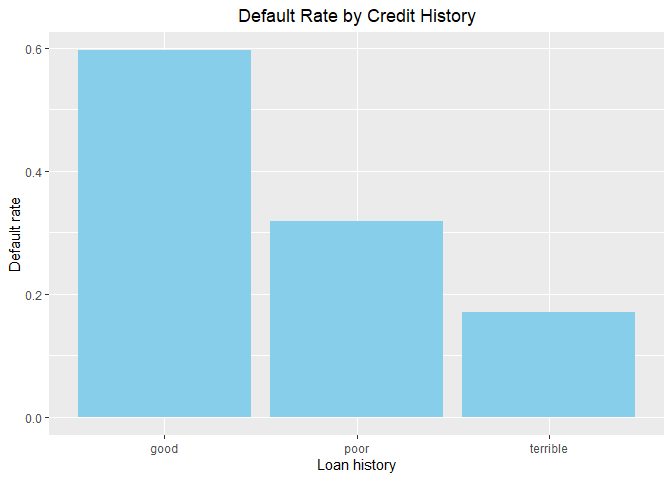

# ECO395M Homework 2

### Kimberly Hu, Meilin Li, Yueting Zhang

### 2/8/2024

## 1. Saratoga house prices

This report presents the methodologies and findings from our analysis
aimed at predicting property prices within the jurisdiction, to assist
the local taxing authority in forming accurate market valuations for
taxation purposes. Utilizing the SaratogaHouses data set as a basis for
our models, we constructed a Lasso linear regression model and a
K-nearest-neighbor regression model. Our objective was to identify the
most accurate and reliable model for property valuation by comparing the
out-of-sample performance of each model.

### Baseline model

We started with a baseline linear model including 11 main effects as
predictors of price. After training models and making predictions
repeatedly for 100 times, we obtained an estimate of the average
out-of-sample RMSE. RMSE measures the average magnitude of prediction
errors and reflects deviations from the actual value. This value serves
as a baseline for performance measurement of our models.

Estimate of out-of-sample RMSE for baseline model:

    ##   result 
    ## 66191.59

### Lasso model

A Lasso regression model was utilized improve the prediction of property
prices. In deciding which variables to include in the Lasso model, we
observed that models with quadratic terms generally outperformed those
with interaction terms. Upon examining the data set, we chose variables
with significant numerical relevance, including lotSize, age, landValue,
livingArea, and pctCollege, as our variables with quadratic terms. We
also included all the main effects in our model. The model was fitted
100 times to ensure robustness, with the average out-of-sample RMSE from
all iterations serving as a measure of the model’s overall performance.
The result indicates that the Lasso model outperforms the baseline model
by achieving lower average RMSE, in other words, making lower prediction
errors.

Estimate of out-of-sample RMSE for the Lasso model:

    ##   result 
    ## 63749.99

### KNN model

Finally, we used KNN regression to predict house prices. For model
construction, we selected the same variables as in the Lasso regression.
The KNN model was trained on scaled data with cross-validation. Again,
model performance is measured by average out-of-sample RMSE. It was
found that the KNN model generates lower RMSE than both the baseline
model and the Lasso model.

Estimate of out-of-sample RMSE for KNN model:

    ## [1] 41177.03

### Conclusion

In our comparative analysis of predictive models, the K-Nearest
Neighbors (KNN) model emerged as the most accurate, achieving the lowest
out-of-sample RMSE and evidently outperforming both the Lasso and the
baseline linear models. This indicates that KNN, with its adaptability
to data’s intricacies, is the most reliable method for predicting
property prices, making it the recommended choice for accurately
determining market values of houses.

## 2. Classification and retrospective sampling

We are dealing with a data set from a German bank including information
about loans. Our goal is to investigate how default probability is
related to characteristics of loans, and try to make predictions based
on the information.

The bar plot above describes the default rate categorized by different
levels of credit history. There are three levels of history: “Good”,
“Poor”, and “Terrible”. By observing the plot we can see that among
three levels of credit history, the loans with “Good” history have the
highest defaulted rate, while the loans with “Terrible” history have the
lowest defaulted rate. This result is counter-intuitive, because it
suggests that better credit history is related to higher loan default
rate.

We built a prediction model with logistic regression to see if some loan
characteristics are good predictors of the default rate. The predictors
used are: `duration`, `amount`, `installment`, `age`, `history`,
`purpose`, `foreign`.

Coefficients reported by logistic regression model:

    ##         (Intercept)            duration              amount 
    ##               -0.77                0.03                0.00 
    ##        installment2        installment3        installment4 
    ##               -0.05                0.41                0.58 
    ##                 age         historypoor     historyterrible 
    ##               -0.01               -1.22               -1.95 
    ##          purposeedu purposegoods/repair       purposenewcar 
    ##                0.86                0.35                1.00 
    ##      purposeusedcar       foreigngerman 
    ##               -0.67               -1.36

Confusion matrix:

    ##    yhat
    ## y     0   1
    ##   0 126   4
    ##   1  60  10

According to the confusion matrix: error rate = (4+60)/200=0.32, which
indicates 68% accuracy. This is not a very high accuracy rate.

Although the coefficients indicate reasonable relationship between
default rate and some characteristics, we can still see
counter-intuitive relationships, as well as an unsatisfactory accuracy
rate. Combining the regression result and the bar plot, we can
reasonably make a hypothesis that there’s something in the data which
prevents us from making successful predictions.

Calculate counts of samples falling into different categories:

    ## [1] "Number of 'good' credit history =  89"

    ## [1] "Number of 'poor' credit history =  618"

    ## [1] "Number of 'terrible' credit history =  293"

Here we can see a huge gap between counts. That is to say, oversampling
of some certain categories in the data may potentially be the reason why
counter-intuitive statistical results occur. The loans with “good”
credit history are underrepresented in the data, and a large portion of
them happen to be defaulted loans. This problem may have been caused by
how the data was originally selected. Since the loans in the data set
was manually selected based on whether the loans have similar situations
as the defaulted loans, these loans in the data set cannot represent the
real life distribution of borrowers.

Thus, this data set is an inappropriate one for building a predictive
model for defaults. To classify borrowers into “low” and “high”
defaulted probability categories, the bank needs a data set which more
accurately represents the real distribution and situations of the
potential borrowers. For example, randomized sampling can be a good way
to achieve this.

## 3. Children and hotel reservations

### Model building

We are interested in building a model that predicts whether a hotel
booking will have children on it. To evaluate the performance of our
model, we first built two baseline models.  
1. Logistic regression model with the following predictors:
`market_segment`, `adults`, `customer_type`, `is_repeated_guest` 2.
Logistic regression model that uses all the existing predictors except
`arrival_date`

`arrival_date` is a character variable that is difficult to incorporate
directly into the model, so we extracted the month from the date, which
is a factor of 12 levels, and included `month` as an additional
predictor. We used backward selection on all predictors to selection the
best combination of features. As a result, `previous_cancellations` and
`deposit_type` are excluded. We did not include interactions or
quadratics because they did not significantly increase performance of
our model.

To evaluate the out-of-sample performance, we produced confusion
matrices and calculated TPR, FPR and FDR for the three models. Compared
to baseline model 2, the model we built yields a higher TPR, which means
it correctly identifies more bookings with children. However, it also
has higher FPR and FDR, indicating that more bookings with no children
are falsely predicted as having children.

    ## Model 1 Confusion Matrix:
    ##    yhat
    ## y      0
    ##   0 8277
    ##   1  723
    ## 
    ## Model 2 Confusion Matrix:
    ##    yhat
    ## y      0    1
    ##   0 8171  106
    ##   1  466  257
    ## 
    ## Model 3 Confusion Matrix:
    ##    yhat
    ## y      0    1
    ##   0 8169  108
    ##   1  465  258

    ##               TPR        FPR      FDR
    ## Model 1 0.0000000 0.00000000      NaN
    ## Model 2 0.3554633 0.01280657 0.292011
    ## Model 3 0.3568465 0.01304821 0.295082

### Model validation step 1

We validated our model using a validation data set. The ROC curve is
shown below. The curve lies above the straight line, which means that
the model makes better predictions than random guesses.

### Model validation step 2

By performing predictions for 20 folds and summing up the predictions
within each fold, we found that our model consistently under-predicts
the number of booking with children. The plot below compares the actual
values and the predicted values, and shows that there is still a lot of
room for improvement.

## 4. Mushroom classification

For this question, our goal is to predict whether a mushroom is
poisonous based on attributes of the mushroom. Since all of the
variables are categorical, it makes sense to apply one-hot encoding for
all of them, and use lasso-penalized logistic regression to select the
variables that have predictive power. We dropped the `veil.type`
variable, because it only has one value in this data set.

A plot of our lasso model and the optimal lambda are shown below.

    ##    seg100 
    ## -5.540636

Variables with non-zero coefficients selected by the algorithm:

    ##  [1] "intercept"                 "cap.shapec"               
    ##  [3] "cap.surfaceg"              "bruisest"                 
    ##  [5] "odorc"                     "odorf"                    
    ##  [7] "odorl"                     "odorm"                    
    ##  [9] "odorn"                     "odorp"                    
    ## [11] "gill.spacingw"             "gill.sizen"               
    ## [13] "stalk.rootc"               "stalk.rootr"              
    ## [15] "stalk.surface.above.ringk" "stalk.surface.above.rings"
    ## [17] "stalk.color.above.ringc"   "stalk.color.above.ringy"  
    ## [19] "stalk.color.below.ringc"   "stalk.color.below.ringy"  
    ## [21] "veil.colory"               "ring.typef"               
    ## [23] "ring.typen"                "ring.typep"               
    ## [25] "spore.print.colorn"        "spore.print.colorr"       
    ## [27] "spore.print.coloru"        "spore.print.colorw"       
    ## [29] "populationn"               "populationv"              
    ## [31] "habitatw"

Using these variables, we were able to generate predicted probabilities
of whether a mushroom is poisonous. The out-of-sample performance was
evaluated using a ROC curve, which plots sensitivity (TPR) versus
specificity (1 - FPR).

The optimal threshold for declaring a mushroom poisonous:

    ## [1] 0.4166857

The confusion matrix below shows that almost all mushrooms are correctly
classified using this threshold. TPR is over 99% and there is no false
positive.

    ##    yhat
    ## y     0   1
    ##   e 864   0
    ##   p   2 759

    ## True Positive Rate: 0.9973719

    ## False Positive Rate: 0

Although the model we built was extremely accurate with predicting
poisonous mushrooms in this data set, we cannot assert that it is a good
model for all cases. There could be training biases given the large
number of categories in the predictors relative to the number of
observations. In fact, based on our results, it is likely that the model
suffers from overfitting. Further validations with new data sets are
necessary to determine whether it is a good prediction model.
